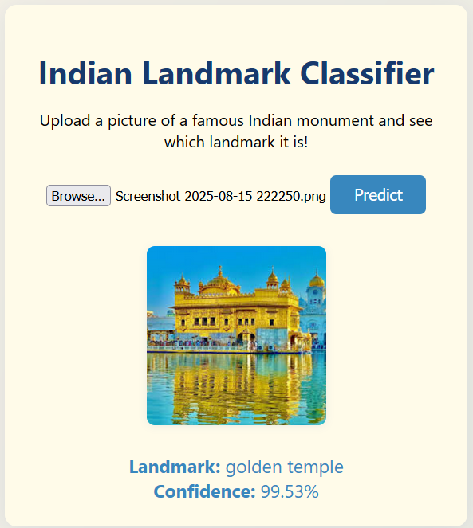
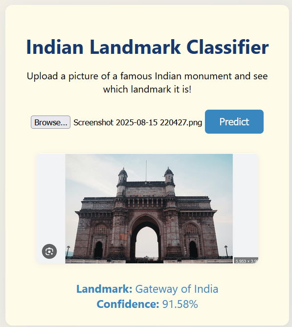
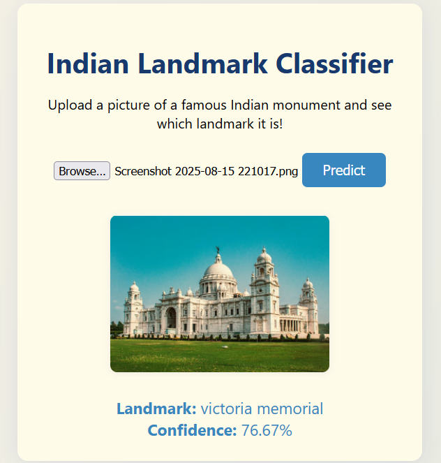

# Indian Landmark Classifier

Recognize famous Indian monuments in images using deep learning!

## Demo Predictions

| Example 1                                       | Example 2                                       | Example 3                                       |
| ----------------------------------------------- | ----------------------------------------------- | ----------------------------------------------- |
|  |  |  |
| Golden Temple                                   | Gateway of India                                | Victoria Memorial                               |
| Confidence: 99.53%                              | Confidence: 91.58%                              | Confidence: 76.67%                              |

> _Above: Screenshots showing successful predictions from the app._

---

## Table of Contents

- [Project Overview](#project-overview)
- [Features](#features)
- [Installation](#installation)
- [Usage](#usage)
- [Folder Structure](#folder-structure)
- [Tech Stack](#tech-stack)
- [Credits](#credits)

---

## Project Overview

This repository contains an end-to-end deep learning project for classifying images of well-known Indian monuments using a custom-trained CNN.  
Users can upload images via a simple web UI and get instant predictions of the landmark name and model confidence.

---

## Features

- **Deep Learning backend** with TensorFlow/Keras
- **Fast Flask API** for predictions
- **User-friendly frontend**: HTML, CSS, JS (no React needed)
- **Monument classes covered**: 'Ajanta Caves', 'Charar-E- Sharif', 'Chhota_Imambara', 'Ellora Caves',
  'Fatehpur Sikri', 'Gateway of India', 'Humayun_s Tomb', 'India gate pics',
  'Khajuraho', 'Sun Temple Konark', 'alai_darwaza', 'alai_minar',
  'basilica_of_bom_jesus', 'charminar', 'golden temple', 'hawa mahal pics',
  'iron_pillar', 'jamali_kamali_tomb', 'lotus_temple', 'mysore_palace',
  'qutub_minar', 'tajmahal', 'tanjavur temple', 'victoria memorial'.
- **Screenshot proofs included** for easy verification

---

## Installation

1. **Clone the repository:**

   ```
   git clone https://github.com/yourusername/indian-landmark-classifier.git
   cd indian-landmark-classifier
   ```

2. **Install backend dependencies:**

   ```
   pip install flask tensorflow numpy pillow flask-cors
   ```

3. **Start the backend server:**

   ```
   cd backend
   python app.py
   ```

4. **Open the frontend:**
   - Double-click `frontend/index.html` OR
   - Open in VSCode Live Server

---

## Usage

1. Click **"Predict"** on the main page after uploading your monument photo.
2. The predicted landmark and confidence will display below.
3. See examples above for typical results.
4. To retrain or update the model, use the provided Jupyter notebook under `notebooks/`.

---

## Folder Structure

<pre> ```.
├── notebooks/
│ └── project-notebook.ipynb
├── backend/
│ ├── app.py
│ ├── requirements.txt
│ └── model/
│ └── my_model.h5
├── frontend/
│ ├── index.html
│ ├── styles.css
│ ├── scripts.js
│ └── screenshots/
│ ├── pred1.png
│ ├── pred2.png
│ └── pred3.png
├── README.md
├── .gitignore
└── LICENSE
``` </pre>

---

## Tech Stack

- **Python** (TensorFlow, Flask, Flask-CORS, Numpy, Pillow)
- **HTML/CSS/JS** frontend (no frameworks needed)
- **Jupyter Notebook** (for training and experimentation)

---

## Credits

- _Dataset_: [Indian Monuments Dataset](https://www.kaggle.com/danushkumarv/indian-monuments-image-dataset)
- _Developed by_: [Tejas M](https://github.com/torin25)
